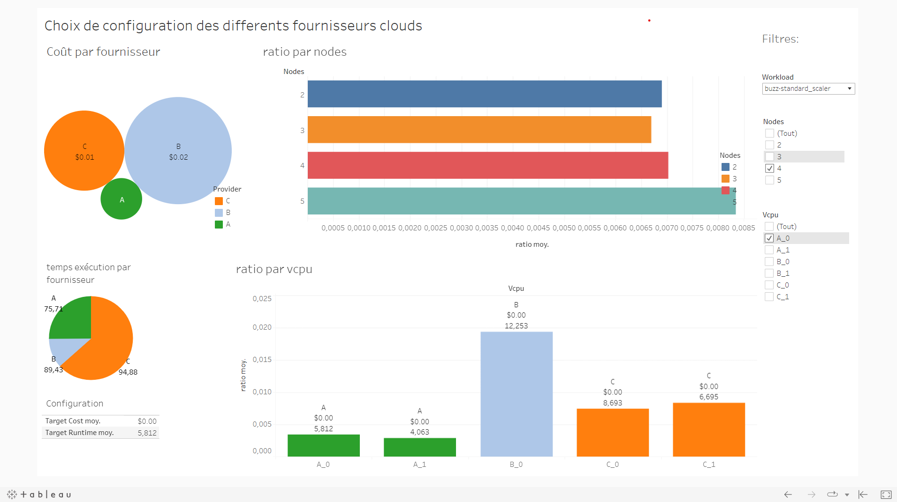

# Multi-cloud configuration Viz

## Introduction

We present the multi-cloud configuration dataset, collected for the purpose of comparing and evaluating various multi-cloud configuration algorithms. The goal of such algorithms is to, for a given workload, select which cloud provider and its respective configuration should be used in order to minimize the cost or runtime of the workload. 

We believe that the scientific community would be interested in developing new algorithms for this emerging application, but running online experiments is both time consuming and expensive. Our offline dataset allows researchers to compare different optimization algorithms without performing all the necessary cloud experimentation each time. We make our offline dataset publicly available with the hope that it will make multi-cloud configuration research more accessible to the community.

While a [similar dataset](https://github.com/oxhead/scout) has previously been published for the single-cloud configuration problem, to the best of our knowledge there exists no public data relating to the multi-cloud scenario.

## Dataset Overview

An example segment of the dataset is presented below and explained in detail in the following paragraphs.

| provider | A_family | A_vcpu | B_family | B_vcpu | C_family | C_type | C_vcpu | nodes | workload | target_cost | target_runtime | status |
|----|----|----|----|----|----|----|----|----|----|----|----|----|
| A  | 1 | 1 |   |   |   |   |   | 3 | santander-xgboost | 0.004 | 78.889 | ok |
| B  |   |   | 0 | 0 |   |   |   | 5 | buzz-kmeans | 0.010 | 27.047 | ok |
| C  |   |   |   |   | 0 | 1 | 0 | 2 | santander-xgboost | 0.018 | 598.825 | Timed out. |

#### Multi-cloud domain

Each workload was deployed on a variety of different configurations across three popular cloud providers: `A`, `B` and `C`, which have been anonymized in order to prevent a competitive analysis. For each cloud provider, we used the region closest to our research lab. All configuration parameters included in the dataset are described below and summarized in the table below.

Each provider has several configuration parameters that have to be set, such as the CPU family and type. Most configuration parameters are unique to just one cloud provider and are denoted as, e.g., `A_vcpu` and `B_family`. The values taken by these parameters have been anonymized using label encoding. 

The only configuration parameter which is shared across all cloud providers is the number of `nodes`.

This resulted in a total of 88 different multi-cloud configurations.

| Parameter | Values     |
|-----------|------------|
| A_family  | 0, 1, 2    |
| A_vcpu    | 0, 1       |
| B_family  | 0, 1       |
| B_vcpu    | 0, 1       |
| C_family  | 0, 1       |
| C_type    | 0, 1, 2    |
| C_vcpu    | 0, 1       |
| nodes     | 2, 3, 4, 5 |

#### Measured metrics

We have considered 2 optimization targets: **runtime** and **cost**. 
For each workload on each configuration, we measured the total execution runtime.
Subsequently, we estimated the execution cost by multiplying the runtime by the hourly price for each type of node and by the number of nodes. This is an imperfect estimate, as it does not include additional data transfer costs that may occur. However, it is difficult to estimate the cost more precisely, as cloud billing is done through monthly aggregate invoices.

#### Workloads

We have considered a range of distributed data analytics tasks, which were implemented using the [Dask framework](https://www.dask.org/). We chose dask because it has a clean integration with Kubernetes and supports a wide variety of tasks. We used 10 different ML training and data pre-processing tasks running with 3 different input datasets, listed in the table below. The dataset comprises 30 workloads defined as (Dask task, input dataset) pairs.

| Dask tasks | Input datasets |
|-----|-----|
| kmeans, linear regression, logistic regression, naive bayes, poisson regression, polynomial features, spectral clustering, quantile transformer, standard scaler, xgboost | [buzz in social media](http://archive.ics.uci.edu/ml/datasets/Buzz+in+social+media+), [credit card](https://www.kaggle.com/datasets/mlg-ulb/creditcardfraud), [santander](https://www.kaggle.com/c/santander-customer-transaction-prediction) |


## Use
We make visualization to help choice the cloud provider and optimum configuration based on cost and runtime combined in unique variable ratio = alpha x cost + beta x runtime.
We can choose to prioritize cost or runtime by varying value of alpha and beta

For a workload, visualization help  to choose :
> number of Nodes ?

>  which provider / vcpu / family ?

<p align="center">
 
</p>


## Inpired By
```
@inproceedings{CloudBandit,
  title={Search-based Methods for Multi-Cloud Configuration},
  author={Lazuka, Malgorzata and Parnell, Thomas and Anghel, Andreea and Pozidis, Haralampos},
  booktitle={the IEEE International Conference on Cloud Computing (IEEE CLOUD 2022)}
  year={2022}
}
```
